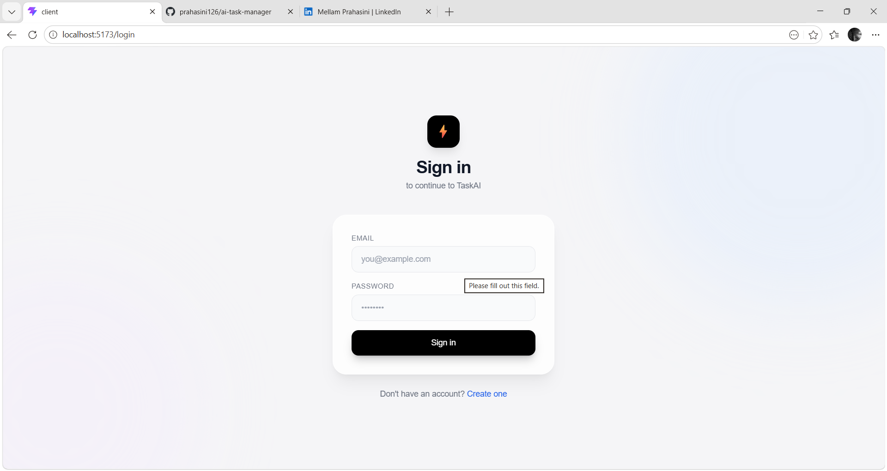
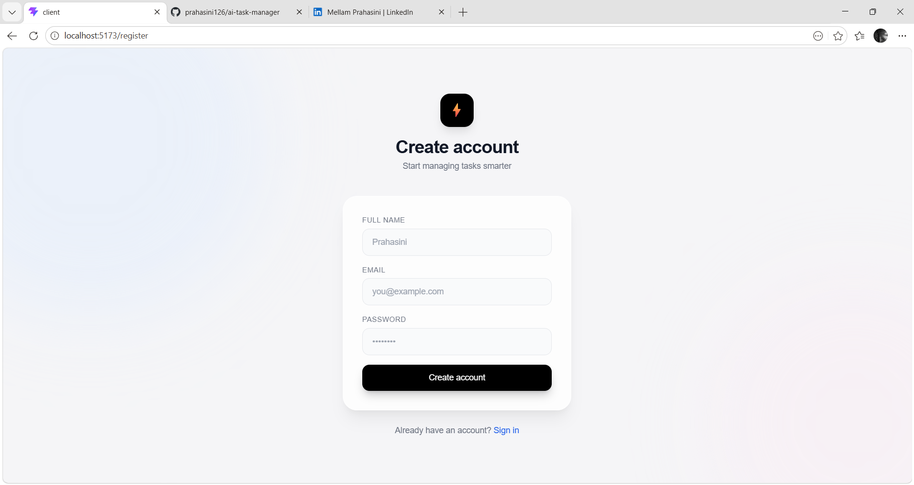
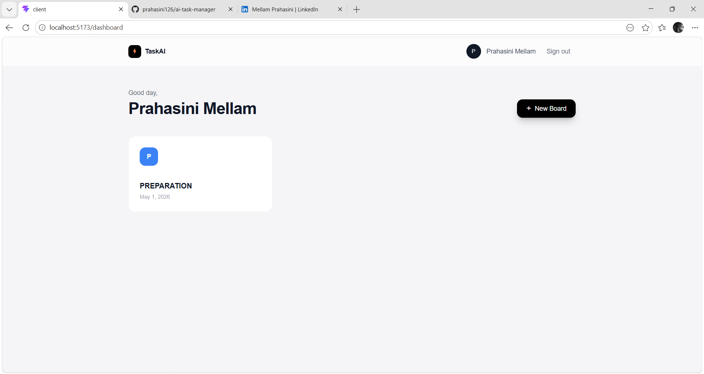
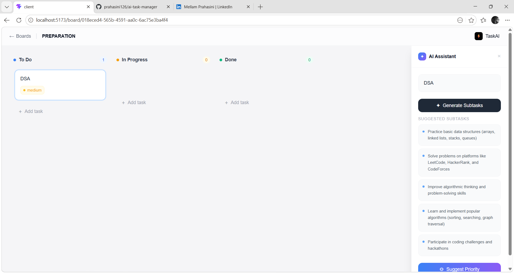

# ⚡ TaskAI — AI-Powered Task Manager

A full-stack Kanban board with AI capabilities built with React, Node.js, and PostgreSQL.

🔗 **Live Demo**: [your-vercel-url.vercel.app](https://your-vercel-url.vercel.app)

## ✨ Features

- 🔐 **JWT Authentication** — Secure register/login with bcrypt
- 📋 **Kanban Board** — Drag & drop tasks across columns
- 🤖 **AI Subtask Generation** — Auto-generate subtasks from task title
- 🎯 **AI Priority Suggestion** — Smart priority recommendations
- ⚡ **Real-time Updates** — Socket.io for live collaboration
- 📱 **Responsive Design** — Works on all devices

## 🛠️ Tech Stack

| Layer | Technology |
|-------|-----------|
| Frontend | React, Vite, TailwindCSS |
| Backend | Node.js, Express |
| Database | PostgreSQL (Supabase) |
| ORM | Prisma |
| Auth | JWT + bcrypt |
| Real-time | Socket.io |
| AI | Groq (Llama 3.1) |
| Deploy | Vercel + Render |

## 🚀 Getting Started

### Prerequisites
- Node.js 18+
- PostgreSQL database

### Installation

```bash
# Clone the repo
git clone https://github.com/prahasini126/ai-task-manager

# Install frontend dependencies
cd client && npm install

# Install backend dependencies  
cd ../server && npm install

# Set up environment variables
cp .env.example .env
# Fill in your DATABASE_URL, JWT_SECRET, GROQ_API_KEY

# Run database migrations
npx prisma migrate dev

# Start backend
npm run dev

# Start frontend (new terminal)
cd ../client && npm run dev
```

## 📸 Screenshots







## 📄 License
MIT

## 👩‍💻 Author
**Mellam Prahasini**
- GitHub: [@prahasini126](https://github.com/prahasini126)
